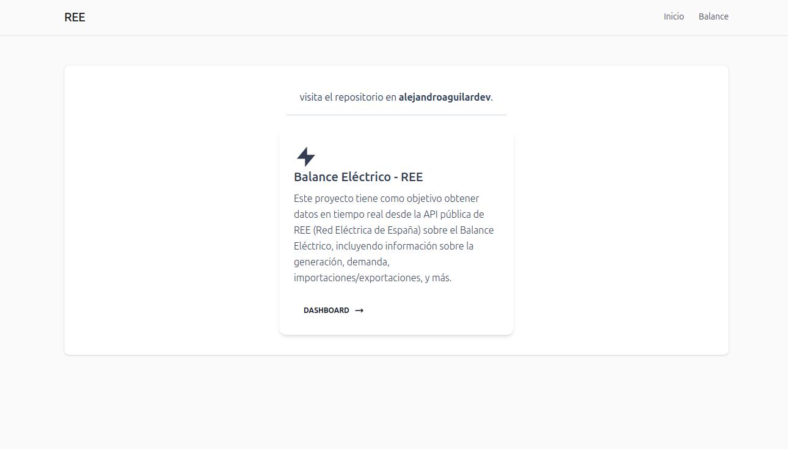
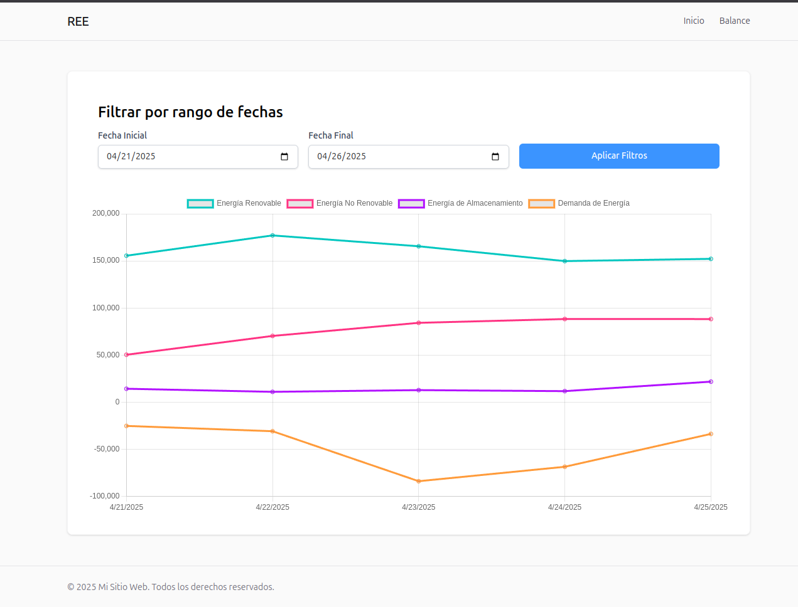

## Tecnologías Usadas

### Backend:
- **NestJS**: Framework para construir el backend con soporte para GraphQL y MongoDB.
- **MongoDB**: Base de datos para almacenar los datos históricos y actuales del balance eléctrico.
- **GraphQL**: API para interactuar con los datos de balance eléctrico.
- **Mongoose**: ODM para MongoDB, utilizado para interactuar con la base de datos.
- **Jest**: Framework de testing para backend.

### Frontend:
- **React**: Biblioteca para construir la SPA.
- **Tailwind CSS**: Framework de diseño para crear interfaces responsivas y rápidas.
- **Chart.js**: Biblioteca para mostrar representaciones gráficas de los datos.
- **React Testing Library**: Herramienta para realizar pruebas unitarias e integradas en el frontend.
- **React Hook Form**: Biblioteca para manejar formularios en el frontend.

### DevOps:
- **Docker**: Contenerización del backend y frontend.
- **Docker Compose**: Herramienta para definir y ejecutar aplicaciones Docker multi-contenedor.

## Instalación

### 1. Clonar el repositorio:

```bash
git clone <repositorio_url>
cd <nombre_del_repositorio>
```

### 2. Instalar las dependencias:

```bash
npm install
```

### 3. Configuración de variables de entorno:

Copia las variables de entorno del archivo `.env.template` a `.env` en las siguientes carpetas:

- **Frontend**: Copia las variables de entorno en la carpeta `web`.
- **Backend**: Copia las variables de entorno en la carpeta `server`.

### 4. Levantar los contenedores con Docker Compose:

```bash
docker-compose up -d
```

Esto creará y levantará los contenedores para MongoDB, frontend y backend.

## Ejecución de Tests

### Backend:

1. Navega a la carpeta `server`:

```bash
cd server
```

2. Ejecuta los tests:

```bash
npm run test
```

### Frontend:

1. Navega a la carpeta `web`:

```bash
cd web
```

2. Ejecuta los tests:

```bash
npm run test
```

## Uso del Sistema

### Backend

El backend expone una API **GraphQL** para consultar los datos del balance eléctrico.


### Frontend

El frontend es una SPA construida con **React** y consume la API GraphQL expuesta por el backend.

La interfaz visualiza:

- Los datos del balance eléctrico para un rango de fechas.
- Una representación gráfica de los datos utilizando **Chart.js**.

## Capturas de Pantalla

A continuación se muestran capturas de la interfaz en funcionamiento:


### Home


### Balance



---